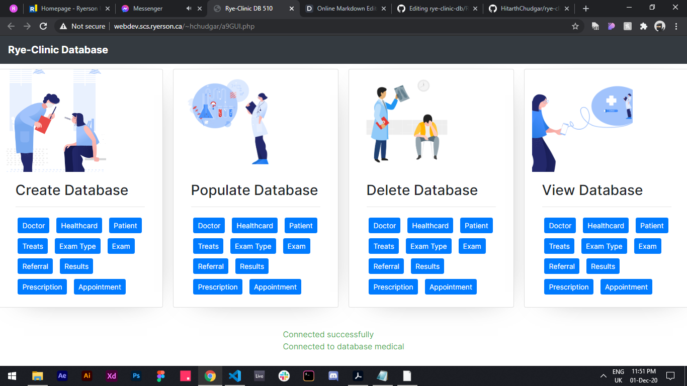

# rye-clinic-db
Term Project for CPS 510 at Ryerson

[](https://travis-ci.org/joemccann/dillinger)



The Medical Clinic System Consists of 10 relational tables - 

-   **Doctor**
-   **Healthcard**
-   **Patient**
-   **Treats**
-   **Exam Type**
-   **Exam**
-   **Referral**
-   **Results**
-   **Prescription**
-   **Appointment**

### Installation

Start by cloning the repo to your system

```sh
$ git clone https://github.com/HitarthChudgar/rye-clinic-db.git
```

Implementing the database to Ryerson Servers

```sh
<?php
      $servername = "localhost";
      $username = "ryersonuser_cs";
      $password = "sqlpass_cs";
```

Adding your database to reference for connection

```sh
$conn = mysqli_connect($servername, $username, $password, "databasename_cs");
```

Finally copy the contents to webdev folder on the Ryerson Moon Servers and the link should be as follows

http://webdev.scs.ryerson.ca/~ryeuser_cs/a9GUI.php
